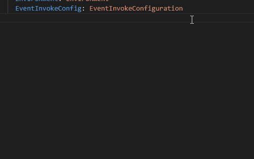
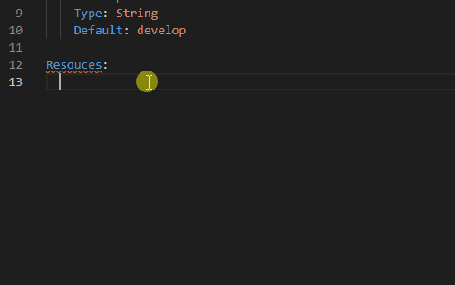

# aws-sam-snippets-VSCode

こちらのリポジトリは VSCode で SAM のテンプレートを快適に記述するために開発中のリポジトリです。
現在開発中のため、対応していない点が多くありますが、最低限の機能から徐々にプッシュしていく予定です。
また、CloudFormation の記述に関しては本リポジトリの対象としていないため、CloudFormation 専用の別拡張機能をご利用ください。

# Release 情報

## 1.0.0

最初のリリース。  
Type: に続く記述をスニペットに追加。
Properties のプロパティ名までを対象とする。

## 2.0.0
 
EventSourceのサポート。  
`sam-event`から続く文字列でスニペットを表示。

# 使用方法

`sam`から続く文字を入力することで、snippet を出すことができます。

\*他の拡張機能と被らないように、sam から始まる文字列とすることにしました。

# 開発の進捗について

現在進捗はフェーズ 1 です。
機能追加の順序は以下を予定しています。

## フェーズ 1

Type: に続く記述をスニペットに追加。
Properties のプロパティ名までを対象とする。

## フェーズ 2 Now
sam-property-function-eventsource.html)など、頻繁に記述するものを対象にする。

[EventSource](https://docs.aws.amazon.com/serverless-application-model/latest/developerguide/

## フェーズ 3

[CorsConfiguration](https://docs.aws.amazon.com/serverless-application-model/latest/developerguide/sam-property-api-corsconfiguration.html)頻繁に記述しないものを対象にする。

## フェーズ 4 以降

順次必要な機能を追加していく。
